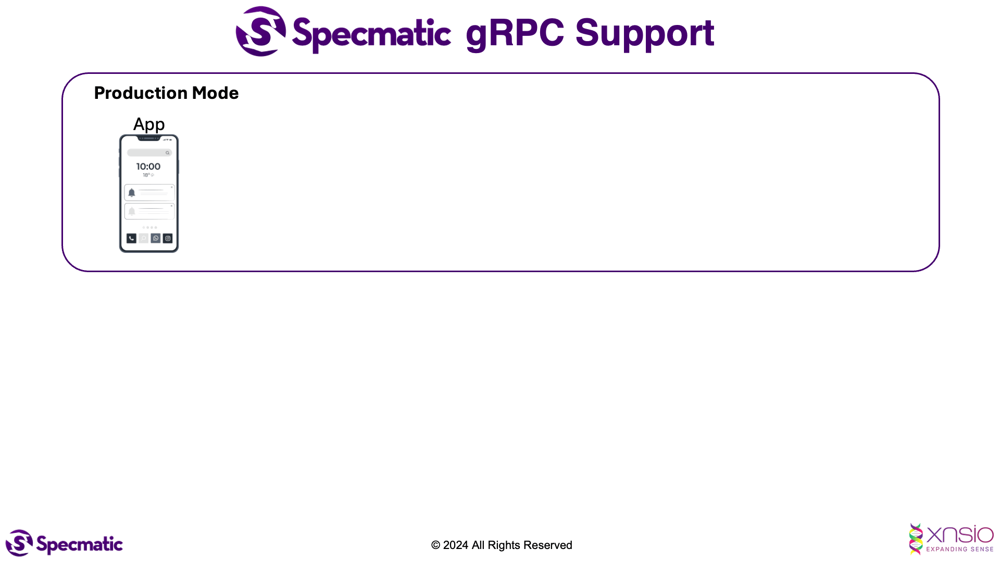

# Specmatic Order BFF gRPC Sample

This sample project demonstrates [Specmatic](https://specmatic.io/) **gRPC support** which allows you to use your **proto files for Contract Testing and Intelligent Service Virtualisation (stubbing/mocking)**.
[Specmatic](https://specmatic.io/) **gRPC support** can also help you use your proto files for #nocode backward compatibility testing and more.



The **specmatic-order-bff-grpc-kotlin** is a gRPC server application developed according to the following proto file, which can be found in the central contract repository:
* [bff.proto](https://github.com/specmatic/specmatic-order-contracts/blob/main/io/specmatic/examples/store/grpc/order_bff.proto)

This BFF project relies on the [OrderAPI domain service](https://github.com/specmatic/specmatic-order-api-grpc-kotlin) which implements the following proto files:
* [order.proto](https://github.com/specmatic/specmatic-order-contracts/blob/main/io/specmatic/examples/store/grpc/order_api/order.proto)
* [product.proto](https://github.com/specmatic/specmatic-order-contracts/blob/main/io/specmatic/examples/store/grpc/order_api/product.proto)

The [`ContractTest`](./src/test/kotlin/com/store/order/bff/ContractTest.kt) class demonstrates how to use Specmatic to test **specmatic-order-bff-grpc-kotlin** gRPC server app using the above proto files.

## Requirements

- Java 17 or later
- Docker Desktop

## Project Setup

1. Clone the repository
   ```shell
   git clone https://github.com/specmatic/specmatic-order-bff-grpc-kotlin
   ```
   
2. Initialize and update the `specmatic-order-contracts` submodule

   ```shell
   git submodule update --init --recursive --remote
   ```

3. Enable automatic submodule updating when executing `git pull`

   ```shell
   git config submodule.recurse true
   ```

4. Run the generateProto task to generate the classes from the proto files

   ```shell
   ./gradlew generateProto
   ```

## Running Contract Tests

### Using Gradle

- On Unix and Windows Powershell:
```shell
./gradlew clean test   
```

-  On Windows Command Prompt:
```shell
gradlew clean test
```

### Using Docker

#### 1. Start the Specmatic gRPC stub server to emulate domain service:
- On Unix and Windows Powershell:
```shell
docker run --rm --network host -v "$(pwd):/usr/src/app" specmatic/enterprise mock
```

- On Windows Command Prompt:
```shell
docker run --rm --network host -v "%cd%:/usr/src/app" specmatic/enterprise mock
```

#### 2. Build and run the BFF service (System Under Test) in a Docker container:

```shell
docker build --no-cache -t specmatic-order-bff-grpc .
```

```shell
docker run --network host -p 8085:8085 specmatic-order-bff-grpc
```

#### 3. Finally, run Specmatic Contract on the BFF service (System Under Test):
- On Unix and Windows Powershell:
```shell
docker run --rm --network host -v "$(pwd):/usr/src/app" specmatic/enterprise test
```

- On Windows Command Prompt:
```shell
docker run --rm --network host -v "%cd%:/usr/src/app" specmatic/enterprise test
```

## Developer notes

Start the BFF Service by executing the following commands:
- On Unix and Windows Powershell:
```shell
./gradlew bootRun
```

-  On Windows Command Prompt:
```shell
gradlew bootRun
```

Start the Specmatic gRPC Stub Server by following the [Docker Instructions](#using-docker)

And now you can debug / test by using [grpcurl](https://github.com/fullstorydev/grpcurl) to verify the setup.

### 1. To list all the methods under OrderService run the below command:
```shell
docker run -it --network host --rm fullstorydev/grpcurl -plaintext localhost:8085 list com.store.order.bff.OrderService
```

Which should give you results as shown below.
```shell
com.store.order.bff.OrderService.createOrder
com.store.order.bff.OrderService.createProduct
com.store.order.bff.OrderService.findAvailableProducts
```

### 2. Executing `findAvailableProducts` method under `OrderService` with a request payload:

To invoke `findAvailableProducts` method with a request payload, you can run the below command:
```shell
docker run -it --network host --rm fullstorydev/grpcurl -plaintext -d '{"pageSize": 10}' localhost:8085 com.store.order.bff.OrderService.findAvailableProducts
```

Which should give you results as shown below.
```json
{
   "products": [
      {
      "id": 608,
      "name": "PXDIO",
      "type": "GADGET",
      "inventory": 148
      }
   ]
}
```

Alternatively you can also use [grpcui](https://github.com/fullstorydev/grpcui) to debug the service if you have direct access to grpcui binary.
```shell
grpcui -plaintext localhost:8085
```

Also observe corresponding logs in the Specmatic Stub Server which is emulating domain service to understand the interactions between BFF and Domain and Service.
